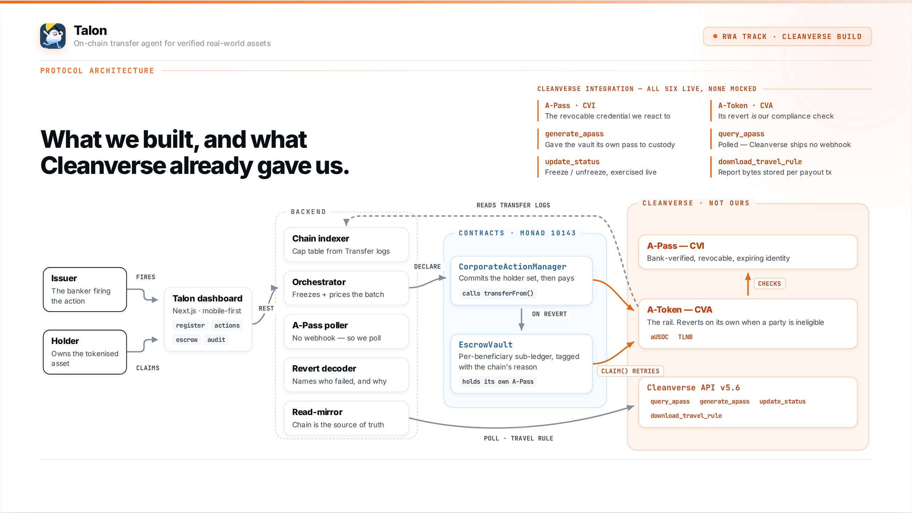

# Talon

**On-chain transfer agent for Cleanverse-verified real-world assets.**

Every RWA project stops at issuance. **Talon begins there** — it runs everything that happens *after* a real-world asset is tokenised: coupons, dividends, redemptions. And it solves the one problem nobody else touches — **eligibility drift**, when a holder's identity lapses between the record date and the pay date.

Built solo for the [Cleanverse Build: Trusted Assets Hackathon](https://cleanverse.com/hackathon) (RWA track).

### Try it now

- ▶ **Demo video:** [watch the walkthrough](https://youtu.be/CT_b-7mUf2U)
- 🖥️ **Live app:** <https://talon-cleanverse-hackathon.vercel.app>
- 🩺 **Backend health:** <https://talon-cleanverse-hackathon.onrender.com/health>
- 📜 **Code:** <https://github.com/hoBabu1/Talon-Cleanverse-Hackathon>
- 🐦 **Builder:** [@thedhanyosmi](https://x.com/thedhanyosmi)

---

## The problem — eligibility drift

A bondholder is verified on the **record date**. The issuer declares a coupon. By the **pay date** — days later — that holder's [A-Pass](https://cleanverse.com) has expired, or their bank has frozen it.

Now the issuer is trapped. Two options exist, and both are wrong:

- **Pay them anyway** → a compliance violation. (Cleanverse's own token won't even allow it — the transfer reverts on-chain.)
- **Withhold the coupon** → theft. They were fully verified when they *earned* it. An expired document is not a forfeiture of property.

**Talon does neither.** It pays every holder who's still compliant, and for everyone else it **holds their money in escrow, per person**, tagged with the *on-chain* reason it couldn't pay — then releases it the moment they re-verify.

```
live cap table → declare action → re-verify every holder at pay date
   → pay directly where compliant
   → escrow per-beneficiary where not (never forfeited)
   → release on re-verification
   → full audit export
```

## Why Cleanverse is essential, not decorative

Eligibility drift **only exists because CVI credentials are revocable and expiring** — that is Cleanverse's own primitive. On a plain ERC-20 there is nothing to drift. Talon is built entirely around reacting to it.

And the key design decision: **Talon never re-implements compliance.** It doesn't keep its own allowlist. At pay date it just attempts the *real* transfer, and Cleanverse's [A-Token](https://cleanverse.com) reverts by itself if a party isn't eligible. Escrow release is a **retry of that same real transfer** — so if it succeeds, the holder is *actually* eligible again, as judged by Cleanverse, not by us. The chain is the source of truth; we only react to it.

---

## Live on Monad testnet — chain ID `10143`

Contracts are **deployed and frozen**. Every address below is clickable:

| What | Address (on [monadscan](https://testnet.monadscan.com)) |
|---|---|
| `EscrowVault` — per-beneficiary escrow engine | [`0xb634…FFB7`](https://testnet.monadscan.com/address/0xb634379B2afdF12830eaef694cFeaE80fB0dFFB7) |
| `CorporateActionManager` — declares + pays | [`0xF897…86b6`](https://testnet.monadscan.com/address/0xF897874bAe28443a60ef92741f7df504F90386b6) |
| Issuer / owner wallet | [`0xfb94…5ba23`](https://testnet.monadscan.com/address/0xfb94354aBd303d6423d285ECD7315F7a45A5ba23) |
| aUSDC — the coupon currency (payment token) | [`0xaC08…f20D`](https://testnet.monadscan.com/address/0xaC0893567D43C3E7e6e35a72803df05416C1f20D) |
| TLNB "Talon Bond 2026" — the asset | [`0xbAE6…1d64`](https://testnet.monadscan.com/address/0xbAE642890988C3EF56e77Fb041aFD847A6131d64) |
| TLNCASH "Talon Cash" — fallback coupon currency | [`0x27e2…Ef4e`](https://testnet.monadscan.com/address/0x27e2F8eCCc535B25C8366e6862b6FD3d9E83Ef4e) |

> **The vault holds A-Tokens because it has its own A-Pass.** Cleanverse checks *both* parties on every transfer — the vault receives money going in and sends it going out, so it must be verified itself. Custody needed a synchronous `/generate_apass` for the vault's address (*not* validator-pool registration, which isn't even configured for Monad here). It carries a ~5-year expiry, watched by the backend poller.

## How it's built



Three independent pieces, one repo:

- **`contracts/`** — [Foundry / Solidity](https://github.com/hoBabu1/Talon-Cleanverse-Hackathon/tree/main/contracts). [`EscrowVault.sol`](https://github.com/hoBabu1/Talon-Cleanverse-Hackathon/blob/main/contracts/src/EscrowVault.sol) (a multi-token, per-beneficiary sub-ledger) + [`CorporateActionManager.sol`](https://github.com/hoBabu1/Talon-Cleanverse-Hackathon/blob/main/contracts/src/CorporateActionManager.sol) (declares an action against a token + record block; tries a direct payout per holder, escrows on revert).
- **`backend/`** — [Node 22 / TypeScript / Fastify](https://github.com/hoBabu1/Talon-Cleanverse-Hackathon/tree/main/backend). The reusable Cleanverse API client, an on-chain indexer that rebuilds the cap table from Transfer logs, an A-Pass poller (Cleanverse ships no webhook, so we poll), a revert decoder that names *who* failed and *why*, and a Supabase read-mirror.
- **`frontend/`** — [Next.js 16 / React 19 / Tailwind](https://github.com/hoBabu1/Talon-Cleanverse-Hackathon/tree/main/frontend). A mobile-first, wallet-connected dashboard: live cap table, corporate actions, the escrow ledger, an audit export, and an issuer-only freeze/reinstate control.

### All six Cleanverse integrations are live — none mocked

`A-Pass · CVI` · `A-Token · CVA` · `generate_apass` · `query_apass` · `update_status` · `download_travel_rule`. Every one runs against the real sandbox. The A-Token's on-chain revert *is* our compliance check; the Travel-Rule report is stored per payout tx.

## Proof it actually works

- **90 contract tests green** — unit, fuzz, and cross-contract invariants (256 runs × depth 64) proving the core invariant through the real CAM→vault wiring:
  ```
  sum(ledger) <= token.balanceOf(vault)
  ```
  `≤`, not `==` — anyone can donate tokens to the vault, and the surplus is recoverable via an owner-only `skim`.
- **`contracts/scripts/live-smoke.mjs`** proves the whole thesis against **real aUSDC on real Monad testnet**: one holder paid directly, a second frozen → escrowed → unfrozen → released → claimed. Drift and recovery, end to end, with money that moves.
- **`backend/src/flow.e2e.test.ts`** (`npm run test:flow`) drives the real routes, real chain, real Cleanverse sandbox and real Supabase — and after every step asserts the **chain and the mirror agree, field by field** (a bug once lived in exactly that seam). 64 live assertions.

## Scales past the demo

Properties the contracts *already have*, not aspirations:

- **One vault, every asset** — a single `EscrowVault` custodies any number of A-Tokens (`beneficiary → token → amount`). No redeploy per asset.
- **Resumable batched execution** — `nextIndex` advances per batch; a run spans as many transactions as needed and survives interruption.
- **Paginated enumeration** — `beneficiariesOf` pages; no unbounded loop can brick a view or hit the gas ceiling.
- **Chained-hash commitment** — each batch folds into `runningHash`, seeded with a provenance binding, so a committed batch can't be replayed against a different action, token, or deployment.
- **Event-sourced** — off-chain state rebuilds from logs; the DB is a read-mirror, never the source of truth.

**On the roadmap:** a self-serve issuer console + SDK so institutions run their own coupon runs, and multi-chain deployment (the backend already speaks Base, Polygon, Arbitrum & BSC).

## Run it locally

Requires Node 22+ and [Foundry](https://book.getfoundry.sh/).

```bash
# Contracts
cd contracts && forge build && forge test

# Backend  (copy .env.example -> .env and fill in)
cd backend && npm install && npm run dev     # GET /health verifies the live Cleanverse sandbox

# Frontend (copy .env.local.example -> .env.local and fill in)
cd frontend && npm install && npm run dev
```

Secrets live only in gitignored `.env` files (`600` perms) and are never committed — see `.env.example` in each package for the required variable names.

## Built by

A solo developer — **[@thedhanyosmi](https://x.com/thedhanyosmi)**. Built in the 48-hour window for the [Cleanverse Build Hackathon](https://cleanverse.com/hackathon), RWA track.

## License

MIT
